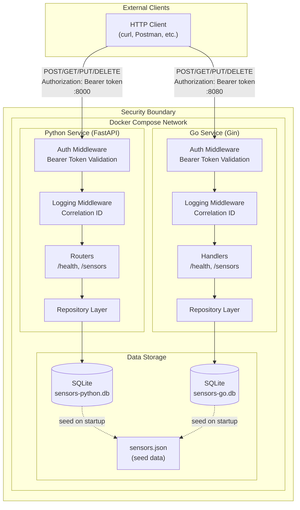

# A1 - Components, APIs & Structured Services

## Service Definition

The **IoT Sensor Service** manages IoT sensor device metadata and readings within a smart home ecosystem. It provides a RESTful API to create, read, update, and delete sensor configurations including device identity, location, measurement type, and current readings. The service persists all sensor data to SQLite and enforces Bearer token authentication on all endpoints to ensure secure access to the sensor registry.

## Project Overview

**Domain:** IoT Smart Home Sensors
**Implementation Languages:** Python (FastAPI) and Go (Gin)
**Persistence:** SQLite
**Authentication:** Bearer Token
**API Specification:** [openapi.yaml](openapi.yaml)

## Stack and Tool Versions

### Python Service
| Component | Version |
|-----------|---------|
| Python | 3.11 |
| FastAPI | 0.109.0 |
| Uvicorn | 0.27.0 |
| Pydantic Settings | 2.1.0 |
| Pytest | 8.0.0 |

### Go Service
| Component | Version |
|-----------|---------|
| Go | 1.21 |
| Gin | 1.9.1 |
| go-sqlite3 | 1.14.19 |
| google/uuid | 1.5.0 |

### Infrastructure
| Tool | Version |
|------|---------|
| Docker | 20.10+ |
| Docker Compose | 3.8 (spec) |
| SQLite | 3.x |

## Project Structure

```
A1/
├── README.md                    # This file
├── openapi.yaml                 # OpenAPI 3.0 specification
├── docker-compose.yml           # Service orchestration
├── architecture.md              # Architecture diagram source (mermaid + ASCII)
├── go-and-python-microservices-running.png  # Screenshot: services running
├── python-tests-running.png     # Screenshot: Python test results
├── go-tests-running.png         # Screenshot: Go test results
├── postman/
│   └── IoT_Sensors_API.postman_collection.json  # Postman collection
├── data/
│   └── sensors.json             # Seed data for database
├── python-service/
│   ├── main.py                  # FastAPI application entry point
│   ├── config.py                # Environment configuration
│   ├── database.py              # SQLite connection and schema
│   ├── requirements.txt         # Python dependencies
│   ├── Dockerfile               # Container definition
│   ├── models/
│   │   └── sensor.py            # Pydantic data models
│   ├── repositories/
│   │   └── sensor_repository.py # Data access layer
│   ├── routers/
│   │   ├── health.py            # Health endpoint
│   │   └── sensors.py           # Sensor CRUD endpoints
│   ├── middleware/
│   │   ├── auth.py              # Bearer token validation
│   │   └── logging.py           # Correlation ID middleware
│   └── tests/
│       └── test_sensors.py      # Integration tests
└── go-service/
    ├── main.go                  # Gin application entry point
    ├── go.mod                   # Go module definition
    ├── Dockerfile               # Container definition
    ├── config/
    │   └── config.go            # Environment configuration
    ├── database/
    │   └── database.go          # SQLite connection and schema
    ├── models/
    │   └── sensor.go            # Data structs and validation
    ├── repositories/
    │   └── sensor_repository.go # Data access layer (interface)
    ├── handlers/
    │   ├── health.go            # Health endpoint handler
    │   └── sensors.go           # Sensor CRUD handlers
    ├── middleware/
    │   ├── auth.go              # Bearer token middleware
    │   └── logging.go           # Correlation ID middleware
    └── tests/
        └── sensors_test.go      # Integration tests
```

## API Endpoints

All endpoints require Bearer token authentication via the `Authorization` header.

| Method | Endpoint | Description |
|--------|----------|-------------|
| GET | `/health` | Service health check |
| GET | `/sensors` | List all sensors |
| GET | `/sensors/{id}` | Get sensor by ID |
| POST | `/sensors` | Create a new sensor |
| PUT | `/sensors/{id}` | Update an existing sensor |
| DELETE | `/sensors/{id}` | Delete a sensor |

### Port Mapping
- **Python Service:** http://localhost:8000
- **Go Service:** http://localhost:8080

## Running the Services

### Prerequisites
- Docker and Docker Compose installed
- Set the `API_TOKEN` environment variable (or use default)

### Quick Start
```bash
# Set your API token (optional, defaults to 'your-secret-token')
export API_TOKEN=my-secret-token

# Start both services
docker-compose up --build
```

### Start Individual Services
```bash
# Python service only
docker-compose up python-service --build

# Go service only
docker-compose up go-service --build
```

### Stop Services
```bash
docker-compose down
```

## Example Requests/Responses

### Authentication
All requests require the `Authorization: Bearer <token>` header:
```bash
curl -H "Authorization: Bearer your-secret-token" http://localhost:8000/health
```

### Health Check
```bash
curl -H "Authorization: Bearer your-secret-token" http://localhost:8000/health
```
Response:
```json
{
  "status": "ok",
  "service": "python"
}
```

### List Sensors
```bash
curl -H "Authorization: Bearer your-secret-token" http://localhost:8000/sensors
```
Response:
```json
{
  "sensors": [
    {
      "id": "sensor-001",
      "name": "Living Room Thermostat",
      "type": "temperature",
      "location": "living_room",
      "value": 72.5,
      "unit": "fahrenheit",
      "status": "active",
      "last_reading": "2026-01-15T10:30:00Z"
    }
  ],
  "count": 1
}
```

### Create Sensor
```bash
curl -X POST \
  -H "Authorization: Bearer your-secret-token" \
  -H "Content-Type: application/json" \
  -d '{
    "name": "Garage Door Sensor",
    "type": "contact",
    "location": "garage",
    "value": 1,
    "unit": "boolean",
    "status": "active"
  }' \
  http://localhost:8000/sensors
```
Response (201 Created):
```json
{
  "id": "sensor-007",
  "name": "Garage Door Sensor",
  "type": "contact",
  "location": "garage",
  "value": 1.0,
  "unit": "boolean",
  "status": "active",
  "last_reading": "2026-01-22T14:30:00Z"
}
```

### Update Sensor
```bash
curl -X PUT \
  -H "Authorization: Bearer your-secret-token" \
  -H "Content-Type: application/json" \
  -d '{"value": 75.0, "status": "inactive"}' \
  http://localhost:8000/sensors/sensor-001
```

### Delete Sensor
```bash
curl -X DELETE \
  -H "Authorization: Bearer your-secret-token" \
  http://localhost:8000/sensors/sensor-001
```
Response: 204 No Content

### Unauthorized Request (No Token)
```bash
curl http://localhost:8000/sensors
```
Response (401):
```json
{
  "detail": "Not authenticated"
}
```

## Running Tests

### Python Tests
```bash
cd python-service
pip install -r requirements.txt
pytest tests/ -v
```

### Go Tests
```bash
cd go-service
go test ./tests/ -v
```

### Test Evidence


## Architecture Diagram


*See [architecture.md](architecture.md) for the mermaid source and ASCII diagram.*



---

## How Each Framework Handles DI and Configuration

### Python (FastAPI)

**Dependency Injection:**
FastAPI uses a declarative dependency injection system via the `Depends()` function. Dependencies are declared as function parameters and resolved automatically at request time.

```python
# Example: Repository dependency injection
@router.get("/sensors")
def list_sensors(
    repo: SensorRepository = Depends(get_sensor_repository),
    _: str = Depends(verify_token),  # Auth check
):
    return repo.get_all()
```

Key characteristics:
- Dependencies are functions that yield or return values
- Can be nested (dependencies can have their own dependencies)
- Scoped per-request by default
- Supports async dependencies
- Built-in support for security schemes (HTTPBearer, OAuth2)

**Configuration:**
Uses `pydantic-settings` for type-safe configuration with automatic environment variable loading:

```python
class Settings(BaseSettings):
    api_token: str  # Required
    database_path: str = "/app/data/sensors.db"  # Default

    class Config:
        env_file = ".env"
```

### Go (Gin)

**Dependency Injection:**
Go uses interface-based dependency injection through constructor functions. This is a manual but explicit pattern.

```go
// Interface defines the contract
type SensorRepository interface {
    GetAll() ([]Sensor, error)
    Create(sensor *SensorCreate) (*Sensor, error)
}

// Concrete implementation
type SQLiteSensorRepository struct {
    db *sql.DB
}

// Handler receives repository via constructor
func NewSensorHandler(repo SensorRepository) *SensorHandler {
    return &SensorHandler{repo: repo}
}
```

Key characteristics:
- Interfaces are implicit (no `implements` keyword)
- Dependencies wired explicitly in `main()`
- Easy to mock for testing
- Compile-time type safety
- No runtime reflection overhead

**Configuration:**
Uses environment variables with explicit loading:

```go
type Config struct {
    Port         int
    DatabasePath string
    APIToken     string
}

func Load() (*Config, error) {
    apiToken := os.Getenv("API_TOKEN")
    if apiToken == "" {
        return nil, fmt.Errorf("API_TOKEN required")
    }
    return &Config{APIToken: apiToken}, nil
}
```

---

## Trade-offs Observed

| Aspect | Python (FastAPI) | Go (Gin) |
|--------|------------------|----------|
| **DI Approach** | Built-in, declarative (`Depends()`) | Manual, explicit (constructor injection) |
| **Type Safety** | Runtime validation (Pydantic) | Compile-time checking |
| **Configuration** | Auto-loads from environment/`.env` | Manual environment parsing |
| **Error Handling** | Exceptions with auto-conversion | Explicit error returns |
| **Testing** | pytest fixtures with DI | httptest with manual setup |
| **Lines of Code** | ~400 LOC | ~600 LOC |
| **Docker Image** | 351 MB | 44 MB |
| **Startup Time** | O(n) module imports | O(1) binary execution |

---

## Detailed Analysis of Framework Trade-offs

This section provides an in-depth comparison of the design decisions, implementation patterns, and operational characteristics observed while building identical services in Python (FastAPI) and Go (Gin).

### 1. Dependency Injection Architecture

**FastAPI: Declarative Dependency Resolution**

FastAPI employs a declarative dependency injection system through the `Depends()` function. Dependencies are specified as function parameters, and the framework resolves them automatically at request time using Python's introspection capabilities. The resolution process operates as follows:

1. At application startup, FastAPI inspects route handler signatures
2. For each `Depends()` parameter, it builds a dependency graph
3. At request time, dependencies are resolved in topological order
4. Results are cached per-request to avoid redundant computation

```python
@router.get("/sensors")
def list_sensors(
    repo: SensorRepository = Depends(get_sensor_repository),
    _: str = Depends(verify_token),
):
    return repo.get_all()
```

This implementation contains a three-layer dependency chain: `verify_token` depends on `get_settings()`, which is memoized via `@lru_cache`. This architecture enables elegant composition but introduces implicit behavior that requires framework-specific knowledge to debug.

**Go: Explicit Constructor Injection**

Go's approach eliminates framework-mediated dependency resolution entirely. Dependencies are wired explicitly in `main()` through constructor functions that accept interfaces:

```go
type SensorRepository interface {
    GetAll() ([]Sensor, error)
    Create(sensor *SensorCreate) (*Sensor, error)
}

func NewSensorHandler(repo SensorRepository) *SensorHandler {
    return &SensorHandler{repo: repo}
}
```

The complete dependency graph is visible in approximately 20 lines of `main.go`. This verbosity provides significant benefits: developers can understand application assembly without consulting framework documentation, and the compiler verifies all dependencies at build time.

**Testing Implications**

The dependency injection approach directly affects testability. FastAPI provides `app.dependency_overrides` for runtime substitution, while Go relies on interface satisfaction. Both achieve isolation, but Go requires explicit interface design upfront.

### 2. Configuration Management

**Pydantic Settings: Convention-Based Loading**

The `pydantic-settings` library provides declarative configuration with automatic environment variable binding:

```python
class Settings(BaseSettings):
    api_token: str                                    # Required
    database_path: str = "/app/data/sensors.db"       # Default value
    log_level: str = "INFO"                           # Default value

    model_config = SettingsConfigDict(env_file=".env")
```

Pydantic performs the following operations implicitly:
- Converts `api_token` to `API_TOKEN` for environment lookup
- Loads values from `.env` files if present
- Performs type coercion (e.g., string "8000" to integer)
- Validates constraints and raises `ValidationError` on failure

This "fail fast" behavior ensures misconfiguration is detected at startup rather than runtime. However, the implicit name transformation and multi-source loading can obscure value origins during debugging.

**Go: Explicit Environment Parsing**

Go configuration requires explicit handling of each parameter:

```go
func Load() (*Config, error) {
    apiToken := os.Getenv("API_TOKEN")
    if apiToken == "" {
        return nil, fmt.Errorf("API_TOKEN environment variable is required")
    }

    port := 8080
    if portStr := os.Getenv("PORT"); portStr != "" {
        var err error
        port, err = strconv.Atoi(portStr)
        if err != nil {
            return nil, fmt.Errorf("invalid PORT: %w", err)
        }
    }
    return &Config{APIToken: apiToken, Port: port}, nil
}
```

Every operation is explicit: environment variable names, type conversions, default values, and validation logic. This transparency eliminates ambiguity at the cost of approximately 3x more configuration code.

### 3. Structured Logging Implementation

Both services implement correlation ID propagation for distributed tracing, but the mechanisms differ substantially.

**Python: Context Variables with Filter Injection**

Python's implementation uses `contextvars.ContextVar` for async-safe request-scoped storage:

```python
correlation_id_var: ContextVar[str] = ContextVar("correlation_id", default="")

class CorrelationIdFilter(logging.Filter):
    def filter(self, record: logging.LogRecord) -> bool:
        record.correlation_id = correlation_id_var.get("-")
        return True
```

The correlation ID is set once in middleware and automatically injected into all subsequent log records via the filter chain. This approach integrates with Python's standard logging infrastructure but requires understanding of handlers, formatters, and filters.

**Go: Explicit Parameter Passing**

Go 1.21's `log/slog` package provides structured logging through explicit key-value pairs:

```go
slog.Info("Request completed",
    "correlation_id", correlationID,
    "method", c.Request.Method,
    "status", c.Writer.Status(),
    "duration_ms", duration.Milliseconds(),
)
```

Each log statement explicitly includes the correlation ID. This eliminates hidden state injection but requires consistent discipline across all logging calls. The trade-off favors explicitness over convenience.

### 4. Testing Methodology Comparison

**Pytest: Fixture-Based Dependency Graph**

Python tests leverage pytest's fixture system for reusable setup and teardown:

```python
@pytest.fixture(scope="function")
def temp_db():
    with tempfile.NamedTemporaryFile(suffix=".db", delete=False) as f:
        db_path = f.name
    yield db_path
    os.unlink(db_path)

@pytest.fixture
def client(temp_db):
    with TestClient(app) as test_client:
        yield test_client
```

Fixtures form a dependency graph that pytest resolves automatically. The `scope` parameter controls lifecycle (function, class, module, session), enabling resource sharing where appropriate. This implementation uses function scope to ensure test isolation.

**Go: Explicit Setup Functions**

Go tests use helper functions with explicit cleanup:

```go
func setupTestRouter(t *testing.T) (*gin.Engine, func()) {
    tmpFile, err := os.CreateTemp("", "test-*.db")
    if err != nil {
        t.Fatalf("Failed to create temp file: %v", err)
    }
    db, _ := database.Connect(tmpFile.Name())
    // ... initialization ...

    cleanup := func() {
        db.Close()
        os.Remove(tmpFile.Name())
    }
    return router, cleanup
}

func TestCreateSensor(t *testing.T) {
    router, cleanup := setupTestRouter(t)
    defer cleanup()
    // ... test logic ...
}
```

The cleanup function must be invoked explicitly via `defer`. This pattern requires more boilerplate but makes resource lifecycle completely visible.

### 5. Deployment and Runtime Characteristics

**Quantitative Comparison**

| Metric | Python (FastAPI) | Go (Gin) | Ratio |
|--------|------------------|----------|-------|
| Docker Image Size | 351 MB | 44 MB | 8:1 |
| Base Image | `python:3.11-slim` | `alpine:3.19` | - |
| Startup Complexity | O(n) modules | O(1) binary | - |
| Memory Overhead | ~50 MB baseline | ~10 MB baseline | 5:1 |

**Startup Time Analysis**

Python startup time scales with the number of imported modules. The startup sequence includes:
1. Python interpreter initialization
2. Module discovery and import (`import` statements execute top-to-bottom)
3. FastAPI route registration and dependency graph construction
4. Uvicorn ASGI server initialization

Go startup is effectively constant-time (O(1)) because:
1. The binary contains pre-compiled machine code
2. No module resolution or bytecode compilation occurs
3. Static linking eliminates dynamic library loading

For this service with approximately 15 Python modules, startup time is approximately 500-800ms. The Go service starts in under 50ms. This difference becomes significant in autoscaling scenarios where rapid instance provisioning is required.

**Resource Efficiency**

The 8:1 image size ratio (351 MB vs 44 MB) has direct operational implications:
- Container registry storage costs scale linearly with image size
- Network transfer time during deployment is proportional to image size
- In serverless environments (AWS Lambda, Cloud Run), cold start latency correlates with image size

### 6. Type System and Validation Behavior

A critical difference emerged during implementation involving Go's zero-value semantics. The motion sensor in the sample dataset has `value: 0` (no motion detected).

**Python: Explicit Null Handling**

Pydantic distinguishes between three states:
- Field not provided in JSON: attribute is `None` (if `Optional`) or validation fails
- Field provided as `null`: attribute is `None`
- Field provided as `0`: attribute is `0`

This distinction is possible because Python's type system includes `None` as a first-class value.

**Go: Zero-Value Ambiguity**

Go's type system conflates "not provided" with "zero value":

```go
type SensorCreate struct {
    Value float64 `json:"value" binding:"required"`
}
```

When JSON unmarshaling encounters a missing `value` field, Go initializes it to `0.0`. The `binding:"required"` validator then sees `0.0` and cannot determine whether it was explicitly provided or defaulted.

**Resolution**

Three approaches address this limitation:
1. **Pointer types**: `Value *float64` allows `nil` to represent "not provided"
2. **Remove required validation**: Accept zero as valid (chosen for this implementation)
3. **Sentinel values**: Use impossible values (e.g., `NaN`) to represent absence

Option 2 was selected as the pragmatic solution for this IoT use case where zero is a legitimate sensor reading.

### 7. Framework Selection Criteria

Based on this comparative implementation, the following decision criteria emerge:

**Favor FastAPI (Python) when:**
- Development velocity is prioritized over runtime efficiency
- Team expertise is stronger in Python
- Integration with data science or ML ecosystems is required
- Automatic OpenAPI documentation provides value
- Service complexity is low to moderate

**Favor Gin (Go) when:**
- Runtime performance and resource efficiency are critical constraints
- The service will handle sustained high request volumes (>1000 RPS)
- Deployment targets resource-constrained environments
- Team prefers explicit code over framework conventions
- Compile-time type safety is valued for reliability

For this IoT sensor service, either framework satisfies the functional requirements. The choice should be guided by team expertise, existing infrastructure, and organizational standards rather than technical capability.

---

## Sample Dataset

The `data/sensors.json` file contains 6 IoT sensors representing a smart home setup:

| Sensor ID | Name | Type | Location | Value |
|-----------|------|------|----------|-------|
| sensor-001 | Living Room Thermostat | temperature | living_room | 72.5°F |
| sensor-002 | Front Door Motion | motion | front_entrance | false |
| sensor-003 | Kitchen Humidity | humidity | kitchen | 45.2% |
| sensor-004 | Bedroom Light | light | master_bedroom | 0% |
| sensor-005 | Backyard Air Quality | air_quality | backyard | AQI 42 |
| sensor-006 | Office CO2 Monitor | co2 | home_office | 620 ppm |

---

## Environment Variables

| Variable | Required | Default | Description |
|----------|----------|---------|-------------|
| `API_TOKEN` | Yes | `your-secret-token` | Bearer token for authentication |
| `DATABASE_PATH` | No | `sensors-python.db` / `sensors-go.db` | SQLite database file path (separate per service) |
| `SEED_DATA_PATH` | No | `/app/data/sensors.json` | JSON file to seed database |
| `LOG_LEVEL` | No | `INFO` | Logging level |
| `LOG_FORMAT` | No | `json` | Log format (json or text) |
| `PORT` | No | 8000/8080 | Service port |

**Note:** Each service maintains its own separate SQLite database (`sensors-python.db` for Python, `sensors-go.db` for Go) to allow both services to run simultaneously without database conflicts.

---

## Validation Rules

| Field | Type | Required | Constraints |
|-------|------|----------|-------------|
| name | string | Yes | 1-100 characters |
| type | string | Yes | One of: temperature, motion, humidity, light, air_quality, co2, contact, pressure |
| location | string | Yes | 1-100 characters |
| value | number | Yes | Any numeric value |
| unit | string | Yes | 1-50 characters |
| status | string | Yes | One of: active, inactive, error |

---

## Appendix: Reflection (from A0)

### Why I Chose IoT Smart Home Sensors

In short, I chose IoT Smart Home Sensors because they sounded fun and potentially useful. Last term, one of my classmates had a sensor-based project and I thought that it might be interesting to try when it was offered in this course. Moreover, I might actually try to implement some version of this in my home with actual sensors and integrate it into other personal projects. My undergraduate major was electrical engineering, and while I haven't worked in that industry since graduating, I think it's time to dip my toes back in.

### Why I Chose Python and Go

I relied on Claude's recommendations in the process of selecting my two languages to compare, which ended up being **Python** and **Go**. I was inclined toward **Python** going into this process anyway as I was familiar with it.

I chose **Python (FastAPI)** because it's so well-documented, easy-to-use, and widespread. I would say Python is my go-to language for many use cases anyway, so it seemed natural. Also, since I've been "vibe coding," I'm pretty confident reviewing Python.

I chose **Go with Gin** at Claude's recommendation for the contrast with Python, the industry applicability, and at least a little bit my own desire to do more with it. I have only used Go very slightly in a previous job, and it seems like a language I should be a bit more familiar with.

### What Worked vs. What Confused Me

**What Worked:**
Most of this worked pretty well. The initial files were pretty boilerplate (I reviewed them, asked for a few changes that matched my home's setup, etc.), and I learned some things about Go syntax (for example, := as variable declaration AND assignment as opposed to = for just assignment). I also set up Postman to have available but decided not to use it for this small use case, as it seemed unnecessary.

**What Confused Me:**

Some of the Go syntax was new to me: I needed to learn how it worked and what it meant.
I also decided to add a Sensor class to the Python after reflection for greater robustness even though this light application doesn't really necessitate it.
Another thing I learned is that when adding tags to the Docker containers, "latest" is unstable and bad practice for any sort of submission (and I would imagine especially production), as I will continue to modify things for future assignments (and, if in a commercial application, future versions). I suppose it didn't occur to me that "latest" is what the AI would initially recommend. I continue to learn to question more and more things, even as I thought I questioned some things well enough. There are many little lessons buried in these tasks.
