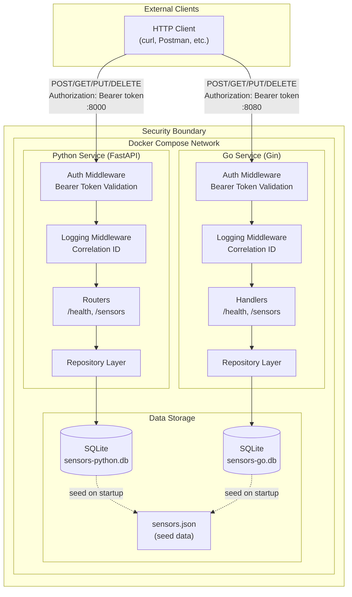

# Architecture Diagram

## Mermaid Diagram (render at mermaid.live or in GitHub)



## ASCII Diagram (for terminals/plain text)

```
┌───────────────────────────────────────────────────────────────────────────┐
│                             EXTERNAL CLIENT                               │
│                       (curl, Postman, Browser)                            │
└───────────────────────────────────────────────────────────────────────────┘
                    │                                   │
                    │ HTTP + Bearer Token               │ HTTP + Bearer Token
                    │ Port 8000                         │ Port 8080
                    ▼                                   ▼
╔═══════════════════════════════════════════════════════════════════════════╗
║                           SECURITY BOUNDARY                               ║
║  ┌────────────────────────────────┐  ┌────────────────────────────────┐  ║
║  │   PYTHON SERVICE (FastAPI)     │  │      GO SERVICE (Gin)          │  ║
║  │                                │  │                                │  ║
║  │  ┌──────────────────────────┐  │  │  ┌──────────────────────────┐  │  ║
║  │  │    Auth Middleware       │  │  │  │    Auth Middleware       │  │  ║
║  │  │  (Bearer Token Check)    │  │  │  │  (Bearer Token Check)    │  │  ║
║  │  └────────────┬─────────────┘  │  │  └────────────┬─────────────┘  │  ║
║  │               ▼                │  │               ▼                │  ║
║  │  ┌──────────────────────────┐  │  │  ┌──────────────────────────┐  │  ║
║  │  │   Logging Middleware     │  │  │  │   Logging Middleware     │  │  ║
║  │  │   (Correlation ID)       │  │  │  │   (Correlation ID)       │  │  ║
║  │  └────────────┬─────────────┘  │  │  └────────────┬─────────────┘  │  ║
║  │               ▼                │  │               ▼                │  ║
║  │  ┌──────────────────────────┐  │  │  ┌──────────────────────────┐  │  ║
║  │  │       Routers            │  │  │  │       Handlers           │  │  ║
║  │  │  /health, /sensors/*     │  │  │  │  /health, /sensors/*     │  │  ║
║  │  └────────────┬─────────────┘  │  │  └────────────┬─────────────┘  │  ║
║  │               ▼                │  │               ▼                │  ║
║  │  ┌──────────────────────────┐  │  │  ┌──────────────────────────┐  │  ║
║  │  │   Repository Layer       │  │  │  │   Repository Layer       │  │  ║
║  │  │ (Dependency Injection)   │  │  │  │ (Dependency Injection)   │  │  ║
║  │  └────────────┬─────────────┘  │  │  └────────────┬─────────────┘  │  ║
║  │               │                │  │               │                │  ║
║  └───────────────┼────────────────┘  └───────────────┼────────────────┘  ║
║                  │                                   │                   ║
║                  ▼                                   ▼                   ║
║  ┌───────────────────────────────────────────────────────────────────┐   ║
║  │                        DATA STORAGE                               │   ║
║  │                                                                   │   ║
║  │  ┌─────────────────┐   ┌─────────────────┐   ┌─────────────────┐  │   ║
║  │  │     SQLite      │   │     SQLite      │   │  sensors.json   │  │   ║
║  │  │sensors-python.db│   │ sensors-go.db   │   │   (seed data)   │  │   ║
║  │  └─────────────────┘   └─────────────────┘   └─────────────────┘  │   ║
║  │                                                                   │   ║
║  └───────────────────────────────────────────────────────────────────┘   ║
║                                                                          ║
╚══════════════════════════════════════════════════════════════════════════╝
```

## Key Components

| Component | Description |
|-----------|-------------|
| **External Client** | Any HTTP client (curl, Postman, browser, other services) |
| **Security Boundary** | Docker network isolating services; all requests must include Bearer token |
| **Auth Middleware** | Validates `Authorization: Bearer <token>` header on every request |
| **Logging Middleware** | Adds correlation ID (`X-Correlation-ID`) for request tracing |
| **Routers/Handlers** | Route definitions and business logic for CRUD operations |
| **Repository Layer** | Data access abstraction (injected via DI) |
| **SQLite Databases** | Separate database per service to avoid conflicts |
| **Seed Data** | `sensors.json` loaded on startup if database is empty |

## Request Flow

1. Client sends HTTP request with `Authorization: Bearer <token>` header
2. Auth Middleware validates token → returns 401 if invalid
3. Logging Middleware generates/extracts correlation ID, logs request
4. Router/Handler processes request, calls Repository
5. Repository executes SQL against SQLite database
6. Response returned with correlation ID in logs
